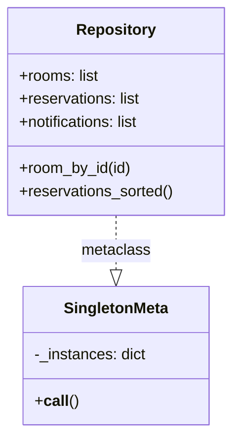
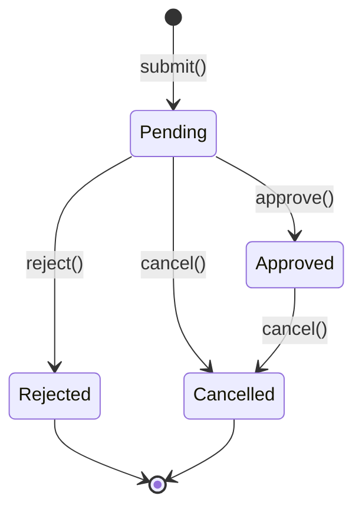
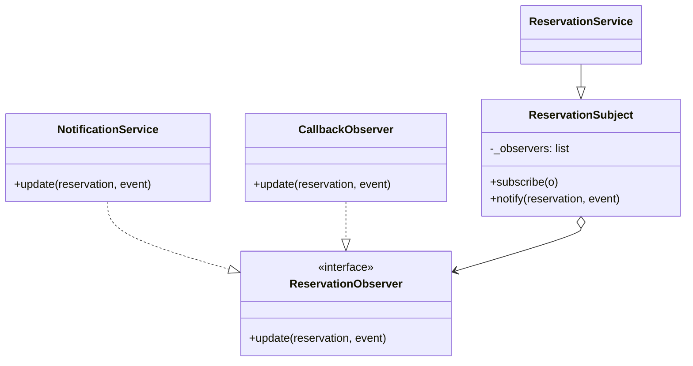
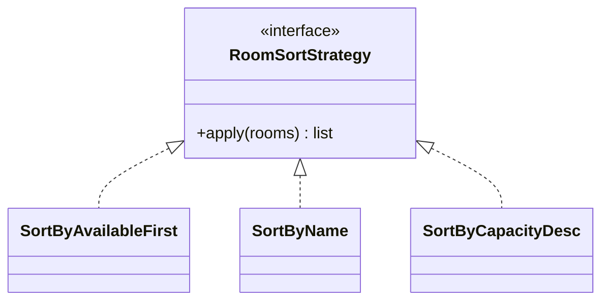

# SIRIUS Undip — Sistem Reservasi Ruangan

Tugas Design Pattern (Python & Flet) — UI dibangun berdasarkan desain Figma
"SIRIUS Undip" (`HV9jRnOoxTZT8FKY2G054m`).

- **Nama project:** SIRIUS Undip — Sistem Reservasi Ruangan Kampus
- **Anggota kelompok:**
  - `<Muhammad Arden Abdalla>` — `<21060121130087>`
  - `<Muhammad Hibat Al Alimi>` — `<21060121140164>`
  - `<Farizi Nufairi Ilman>` — `<21060122140173>`

## 1. Deskripsi Singkat

Aplikasi web (dibangun dengan Flet) untuk mengelola pengajuan peminjaman
ruangan di kampus: mahasiswa menelusuri katalog ruangan, mengajukan
reservasi, memantau riwayat pengajuan beserta statusnya, dan menerima
notifikasi setiap kali status pengajuan berubah.

## 2. Fitur Utama

| Fitur | Halaman | Deskripsi |
|---|---|---|
| Login & Role | `Login` | Autentikasi username/password. Dua role: **Pemohon** dan **Admin** — menu, halaman, dan aksi yang tersedia mengikuti role (lihat bagian 3). |
| Katalog Ruangan | `Katalog` | Menampilkan daftar ruangan beserta fasilitas, kapasitas, dan status ketersediaan. Dapat diurutkan (tersedia dulu / nama / kapasitas). |
| Pengajuan Ruangan | `Pengajuan` | Form input ruangan, jadwal, jam, tujuan, dan dokumen pendukung. Validasi dilakukan di service layer, bukan di UI. |
| Kelola Pengguna *(Admin)* | `Pengguna` | Tambah akun (username, nama, role, password), reset password (password sementara acak, tampil sekali), dan nonaktifkan/aktifkan akun. Ringkasan jumlah pengguna per role. |
| Persetujuan *(Admin)* | `Persetujuan` | Ringkasan jumlah per status, filter (Menunggu/Disetujui/Ditolak/Dibatalkan/Semua), dan tombol **Setujui** / **Tolak** (dengan dialog konfirmasi) untuk pengajuan berstatus Pending. |
| Riwayat Reservasi | `Riwayat` | Daftar reservasi milik pengguna beserta status (Pending/Approved/Rejected/Dibatalkan) dan aksi "Ajukan Pembatalan" bila diizinkan. |
| Notifikasi | `Notifikasi` | Ringkasan jumlah reservasi per status + daftar notifikasi yang dibuat otomatis setiap kali status reservasi berubah. |

Navigasi antar halaman melalui navbar (routing sederhana berbasis state,
lihat `AppState` di `main.py`). Input data melalui form Pengajuan, proses
data melalui `ReservationService`, output/tampilan hasil melalui Riwayat
dan Notifikasi. Penanganan error sederhana: `ValidationError` ditangkap di
view dan ditampilkan sebagai `SnackBar`, bukan membuat aplikasi crash.

## 3. Autentikasi & Role-Based Access

**Akun demo** (data tersimpan di memori, di-seed saat aplikasi start):

| Role | Username | Password |
|---|---|---|
| Pemohon | `Farizi` | `farizi123` |
| Admin | `admin` | `admin123` |

Akun lain dibuat oleh admin lewat halaman **Kelola Pengguna**. Dua akun di atas
adalah akun awal (seed); passwordnya bisa diganti tanpa mengubah kode lewat
environment variable `SIRIUS_FARIZI_PASSWORD` dan `SIRIUS_ADMIN_PASSWORD`.
Username tidak peka huruf besar/kecil.

**Aturan Kelola Pengguna:** username 3-30 karakter (huruf, angka, `.`, `_`, `-`)
dan unik; password minimal 8 karakter berisi huruf dan angka, tidak boleh sama
dengan username. Reset password membuat password sementara acak (10 karakter)
yang hanya ditampilkan sekali ke admin; password lama langsung tidak berlaku.
Akun tidak dihapus, hanya **dinonaktifkan** supaya riwayat reservasinya tetap
utuh: akun nonaktif tidak bisa login dan sesi yang sedang berjalan ikut berakhir.
Admin tidak dapat menonaktifkan akunnya sendiri. Semua aturan ini dicek di
`UserService`, bukan hanya di UI.

| | Pemohon | Admin |
|---|---|---|
| Halaman | Katalog, Pengajuan, Riwayat, Notifikasi | Persetujuan, Kelola Pengguna, Notifikasi |
| Ajukan ruangan | ya | tidak |
| Batalkan reservasi | hanya miliknya sendiri | tidak |
| Setujui / tolak pengajuan | tidak | ya |
| Tambah / reset / nonaktifkan pengguna | tidak | ya |
| Data yang terlihat | reservasi & notifikasi miliknya | semua reservasi; notifikasi untuk admin |

Akses dijaga di **tiga lapis**: (1) menu hanya menampilkan halaman yang menjadi
hak role (`Role.nav_links`); (2) router `resolve_route()` di `main.py` mengalihkan
akses langsung ke halaman terlarang (belum login -> Login, salah role -> halaman
awal role); (3) `ReservationService` memeriksa permission pada setiap aksi
(`submit`, `approve`, `reject`, `cancel` menerima `actor`), jadi aturan tetap
berlaku walau UI dilewati.

**Pencegahan bentrok jadwal.** Satu reservasi memakai ruangan dari jam mulai
sampai jam mulai + durasi ruangan. Dua reservasi bentrok bila ruangan sama dan
rentang waktunya beririsan; jadwal yang saling menyambung (selesai 10:00, mulai
10:00) tidak dianggap bentrok. Hanya reservasi **Approved** yang mengunci slot
(`holds_slot` di State pattern); Rejected dan Dibatalkan otomatis membebaskannya.

- Pengajuan yang bentrok dengan reservasi Approved **ditolak** saat dikirim.
- Form Pengajuan menampilkan peringatan langsung begitu ruangan, tanggal, dan jam terpilih.
- Pengajuan Pending yang waktunya sama dengan Pending lain tetap boleh dikirim
  (peringatan kuning), tetapi saat admin menyetujui salah satu, yang lain tidak
  dapat disetujui lagi. Pengecekan diulang saat persetujuan dan dilakukan atomik
  (`Repository.lock`) agar dua admin tidak bisa lolos bersamaan.
- Di halaman Persetujuan, pengajuan yang bentrok dengan reservasi Approved
  ditandai merah dan tombol **Setujui**-nya disembunyikan.

Keamanan dasar: password disimpan sebagai hash PBKDF2-HMAC-SHA256 dengan salt
acak per user (tidak pernah plaintext), dibandingkan dengan `hmac.compare_digest`;
pesan gagal login sengaja generik; 5 percobaan gagal berturut-turut mengunci
username tersebut selama 30 detik.

## 4. Struktur Project

```
sirius_reservasi/
├── main.py                        # wiring, routing, entry point
├── models/
│   ├── room.py                    # Room, Amenity
│   ├── user.py                    # User + hash password (PBKDF2)
│   ├── reservation.py             # Reservation (State pattern context)
│   └── notification.py            # Notification
├── patterns/
│   ├── singleton.py                # SingletonMeta
│   ├── state.py                    # ReservationState & turunannya
│   ├── observer.py                 # ReservationObserver/Subject
│   ├── role.py                     # Role, Permission (Strategy: kebijakan akses)
│   ├── factory.py                  # NotificationFactory
│   └── strategy.py                 # RoomSortStrategy & turunannya
├── services/
│   ├── repository.py              # Repository (Singleton) — data store
│   ├── auth_service.py            # login/logout, sesi, throttle percobaan gagal
│   ├── user_service.py            # tambah user, reset password, aktif/nonaktif
│   ├── reservation_service.py     # business logic + cek permission + Observer subject
│   ├── notification_service.py    # concrete Observer
│   └── seed.py                    # demo data (lewat service, bukan langsung ke repo)
├── views/                          # Flet UI, tidak berisi business logic
│   ├── theme.py, navbar.py
│   ├── login_view.py, persetujuan_view.py, pengguna_view.py
│   ├── katalog_view.py, pengajuan_view.py
│   ├── riwayat_view.py, notifikasi_view.py
├── assets/fonts/                   # Poppins, Plus Jakarta Sans (bundled, lisensi OFL)
└── requirements.txt
```

Business logic (validasi, transisi status, pembuatan notifikasi) seluruhnya
berada di `models/` dan `services/`, dipanggil dari `on_click` di `views/`
— bukan ditulis langsung di dalam handler Flet.

## 5. Design Pattern yang Digunakan

Lima pattern digunakan (minimum yang diminta: 3, termasuk ≥1 Behavioral).
Dua di antaranya Behavioral (State, Observer), satu Behavioral tambahan
(Strategy), dan dua Creational (Singleton, Factory Method). Strategy dipakai
dua kali: untuk urutan katalog (4.5) dan untuk kebijakan akses per role (4.6).

### 4.1 Singleton — `patterns/singleton.py`, `services/repository.py`

- **Masalah:** setiap halaman (Katalog, Pengajuan, Riwayat, Notifikasi)
  perlu membaca dan menulis daftar ruangan/reservasi/notifikasi yang
  **sama**. Jika tiap service punya penyimpanan sendiri-sendiri, data antar
  halaman akan tidak sinkron.
- **Solusi:** `SingletonMeta` memastikan `Repository()` selalu
  mengembalikan instance yang sama, di mana pun ia dipanggil.
- **Class terlibat:** `SingletonMeta`, `Repository`.
- **Alasan:** satu sumber data yang konsisten tanpa harus mengoper state
  secara manual ke setiap view.



### 4.2 State (Behavioral) — `patterns/state.py`, `models/reservation.py`

- **Masalah:** perilaku `Reservation` berbeda-beda tergantung statusnya —
  reservasi `Pending` bisa disetujui/ditolak/dibatalkan, `Approved` hanya
  bisa dibatalkan, sedangkan `Rejected`/`Dibatalkan` bersifat final. Logika
  `if status == "pending": ... elif ...` akan tersebar di banyak tempat.
- **Solusi:** setiap status adalah class (`PendingState`, `ApprovedState`,
  `RejectedState`, `CancelledState`) yang mengimplementasikan interface
  `ReservationState`. `Reservation` hanya menyimpan referensi ke state saat
  ini dan mendelegasikan `approve()/reject()/cancel()/can_cancel()` ke
  objek tersebut.
- **Class terlibat:** `ReservationState` (abstract), `PendingState`,
  `ApprovedState`, `RejectedState`, `CancelledState`, `Reservation`.
- **Alasan:** menambah status atau mengubah aturan transisi cukup dengan
  mengubah satu class, bukan mencari-cari semua `if status == ...` di UI
  dan service.



### 4.3 Observer (Behavioral) — `patterns/observer.py`, `services/reservation_service.py`

- **Masalah:** saat status reservasi berubah, beberapa hal tidak
  berhubungan langsung harus bereaksi: notifikasi harus dibuat, halaman
  Riwayat harus re-render, ringkasan jumlah di Notifikasi harus diperbarui.
  Jika `ReservationService` memanggil semua ini secara langsung, ia harus
  mengenal UI dan notification layer sekaligus.
- **Solusi:** `ReservationService` (Subject) hanya memanggil
  `self.notify(reservation, event)`. Siapa pun yang peduli, berlangganan
  lewat `subscribe()`. Saat ini ada dua subscriber: `NotificationService`
  (membuat Notification lewat Factory) dan `CallbackObserver` (dipakai
  `main.py` untuk memicu `page.update()`).
- **Class terlibat:** `ReservationObserver`, `ReservationSubject`,
  `CallbackObserver`, `ReservationService`, `NotificationService`.
- **Alasan:** menambah reaksi baru (mis. pengingat email) cukup dengan
  menulis satu observer baru, tanpa mengubah `ReservationService`.



### 4.4 Factory Method — `patterns/factory.py`

- **Masalah:** mengubah event (`"approved"`, `"rejected"`, ...) menjadi
  `Notification` yang siap tampil (ikon, warna, judul, pesan) memerlukan
  aturan format yang sama di setiap tempat ia dibuat.
- **Solusi:** `NotificationFactory.create(event, reservation)` adalah
  satu-satunya tempat yang tahu cara membangun `Notification` dari sebuah
  event. `NotificationService` (observer) memanggil factory ini, tidak
  membangun objeknya sendiri.
- **Class terlibat:** `NotificationFactory`, `Notification`.
- **Alasan:** menambah jenis event baru hanya berarti menambah satu entri
  template, bukan mengubah logic di banyak tempat.

### 4.5 Strategy (Behavioral) — `patterns/strategy.py`, `views/katalog_view.py`

- **Masalah:** halaman Katalog membiarkan pengguna mengganti urutan daftar
  ruangan (tersedia dulu / nama / kapasitas). Jika ditulis sebagai
  `if sort_mode == "name": ... elif ...` di dalam view, logika pengurutan
  bercampur dengan kode UI.
- **Solusi:** setiap aturan urutan adalah class kecil
  (`RoomSortStrategy`) dengan satu method, `apply(rooms)`. View hanya
  menyimpan "strategi aktif" dan memanggil `strategy.apply(rooms)` —
  tidak perlu tahu cara kerja masing-masing strategi.
- **Class terlibat:** `RoomSortStrategy` (abstract), `SortByAvailableFirst`,
  `SortByName`, `SortByCapacityDesc`.
- **Alasan:** menambah urutan baru = menambah satu class, tanpa menyentuh
  `katalog_view.py`.



### 4.6 Strategy (Behavioral) — kebijakan akses per Role — `patterns/role.py`

- **Masalah:** dua sisi (Pemohon, Admin) punya menu, halaman awal, dan hak aksi
  berbeda. Dengan `if user.role == "admin"` di navbar, router, dan service,
  aturan akses tersebar dan mudah tidak sinkron.
- **Solusi:** tiap role adalah class (`PemohonRole`, `AdminRole`) yang membawa
  kebijakannya sendiri: `permissions`, `nav_links`, `home_route`. Kode lain
  hanya bertanya `user.can(Permission.X)` / `role.can_access(route)`.
- **Class terlibat:** `Role` (abstract), `PemohonRole`, `AdminRole`, `Permission`, `User`.
- **Alasan:** role baru (mis. petugas gedung) = satu class baru, tanpa mengubah
  navbar, router, atau service.

Catatan: tiap pengajuan juga menghasilkan notifikasi untuk audiens yang tepat
(pemohon dan/atau admin) lewat `NotificationFactory.create_all`.

## 6. Sebelum vs Sesudah Refactor (contoh: status reservasi)

**Sebelum** (pendekatan naif, tanpa State pattern):

```python
def cancel_reservation(reservation):
    if reservation["status"] in ("rejected", "cancelled"):
        raise ValueError("Tidak bisa dibatalkan")
    reservation["status"] = "cancelled"
```

Setiap aturan baru (mis. "approved tidak boleh diubah setelah H-1") berarti
menambah cabang `if` baru di tempat ini **dan** di setiap tempat lain yang
mengecek status secara manual.

**Sesudah** (dengan State pattern, lihat `models/reservation.py`):

```python
def cancel(self) -> None:
    self._state = self._state.cancel()   # objek state yang memutuskan
```

`PendingState`/`ApprovedState` mengizinkan transisi ke `CancelledState`;
`RejectedState`/`CancelledState` otomatis melempar `InvalidTransition`
karena tidak meng-override `cancel()`. Aturan baru = ubah satu class state,
bukan mencari semua pengecekan status yang tersebar.

**Trade-off:** pattern ini menambah jumlah file/class dibanding solusi
if/elif sederhana — untuk aplikasi sekecil ini, overhead-nya terasa, tapi
disengaja untuk latihan dan akan terbayar begitu jumlah status/aturan
bertambah.

## 7. Cara Menjalankan

```bash
cd sirius_reservasi
pip install -r requirements.txt
flet run --web main.py       # buka di browser, responsif dari ponsel s/d desktop
# atau
flet run main.py             # mode aplikasi desktop
```

Aplikasi berjalan dengan data contoh (`services/seed.py`) yang dibuat
dengan memanggil `ReservationService` yang sesungguhnya (submit →
approve/reject), sehingga Riwayat dan Notifikasi sudah terisi saat
pertama kali dibuka.

## 8. Keterbatasan / Hal yang Perlu Diperiksa

- **Akun tidak tersimpan permanen:** pengguna yang ditambahkan lewat Kelola
  Pengguna (beserta password hasil reset dan status nonaktif) disimpan di memori
  dan **hilang saat aplikasi di-restart**; yang kembali hanya akun seed
  (Farizi, admin). Belum ada fitur ganti password oleh pengguna sendiri.
- **Autentikasi masih prototipe:** tidak ada database user. Sesi login hidup selama tab
  browser terbuka dan hilang saat di-refresh. Untuk produksi, ganti dengan
  penyimpanan user yang persisten dan login terpusat (mis. SSO kampus), serta
  jalankan lewat HTTPS.
- Perubahan oleh admin tampil di sesi pemohon setelah pemohon berpindah halaman
  (belum ada push real-time antar sesi browser).

- Gambar navbar & logo diambil dari URL sementara milik Figma (berlaku
  ±7 hari sejak diekstrak). Setelah kedaluwarsa, navbar otomatis memakai
  warna solid dan logo memakai ikon — **belum dibuat endpoint upload**
  gambar ruangan sungguhan (panel gambar ruangan masih berupa warna +
  ikon).
- Font logo "Pochaevsk" tidak tersedia di Google Fonts sehingga memakai
  fallback serif — tampilan judul navbar akan sedikit berbeda dari Figma.
- Data (rooms/reservations/notifications) disimpan di memori proses
  (`Repository`), bukan database — sesuai ketentuan tugas ("Database tidak
  diwajibkan"), dan akan reset setiap kali aplikasi di-restart.
- Validasi "tidak boleh tanggal lampau" di-bypass khusus untuk data contoh
  di `services/seed.py` (`_allow_past_date=True`) agar Riwayat punya
  contoh reservasi yang sudah selesai; aturan ini tetap berlaku penuh
  untuk pengajuan baru dari form.
